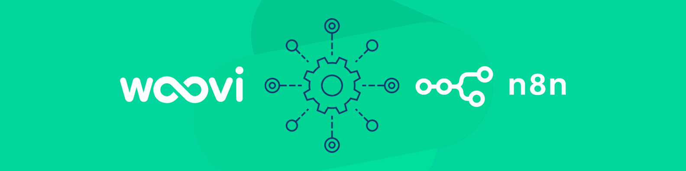

# n8n-nodes-woovi

n8n nodes for create charges and payments with [Woovi](https://woovi.com)

## How to use

### Community Nodes (Recommended)

1. Go to Settings > Community Nodes.
2. Select Install.
3. Enter `n8n-nodes-woovi` in *Enter npm package name.* field.
4. Agree to the risks of using community nodes: select I understand the risks of installing unverified code from a public source.
5. Select Install.

### Manual installation

To get started install the package in your n8n root directory:

`npm install n8n-nodes-woovi`

### Setup

1. Go to Credentials.
2. Select `Add Credential` button.
3. Select `Woovi API` from the *Search for app* dropdown.
4. Get your Woovi API key from [API Getting Started](https://developers.woovi.com/docs/apis/api-getting-started).
5. Enter your Woovi API key in the *API Key* field.

## API Reference

- [Woovi API](https://developers.woovi.com/docs/apis/api-getting-started)

## Contributing

1. Fork it (<https://github.com/entria/n8n-nodes-woovi/fork>)
2. Create your feature branch (`git checkout -b feature/fooBar`)
3. Commit your changes (`git commit -m 'feat(fooBar) Add some fooBar'`)
4. Push to the branch (`git push origin feature/fooBar`)
5. Create a new Pull Request
